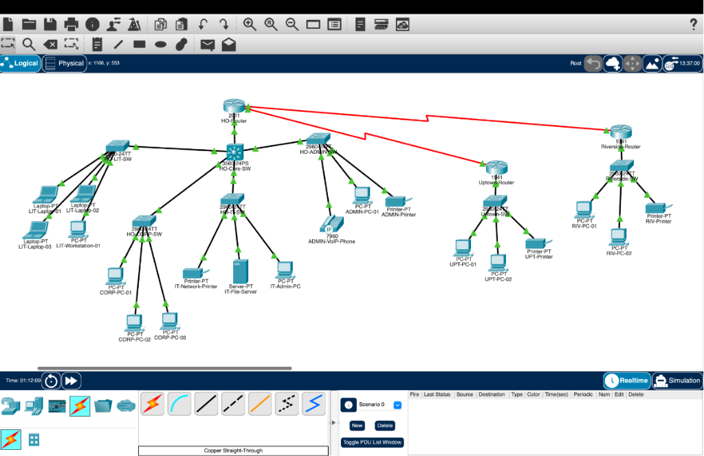

# Harbor Lane Legal Group - Enterprise Network Design

**Subject:** Computer Networks
**Tool:** Cisco Packet Tracer
**Author:** Daksh Srivastava - 150096725087
**Institution:** School of Future Tech

---

## What Is This Project?

This project designs and builds a complete company network for **Harbor Lane Legal Group**, a legal firm that has:

- 1 Head Office (main office)
- 1 Riverside Branch Office
- 1 Uptown Branch Office

All three offices are connected to each other. Each department inside the Head Office has its own separate network so that one department cannot accidentally see another department's data.

The entire network is built and tested inside **Cisco Packet Tracer** — a free simulation software that lets you design real networks without needing physical hardware.

---

## Network Topology



The diagram above shows the complete network. The central router at the top (HO-Router) connects all three locations. Each branch has its own router. Switches connect individual computers, printers, and phones.

---

## The Problem This Project Solves

Harbor Lane Legal Group was expanding and needed a network designed before buying any hardware. Their requirements were:

- Keep department traffic separate (lawyers in one department should not access another department's data)
- Let departments still talk to each other when needed
- Connect all three office locations
- Support computers, printers, and office phones (VoIP)
- Use IP addresses efficiently

---

## Project Files

| File | What It Contains |
|------|-----------------|
| `Harbor_Lane_Legal_Group_Network.pkt` | The actual network built in Cisco Packet Tracer. Open this file with Packet Tracer to see and test the network |
| `CN_Major_project.pdf` | Full project report with all configurations, screenshots, and explanations |

---

## How to Open the Network

1. Download and install **Cisco Packet Tracer** (free from Cisco NetAcad)
2. Open `Harbor_Lane_Legal_Group_Network.pkt`
3. The full network will load — you can click any device to see its configuration

---

## Technologies Used

| Technology | What It Does (Simple Explanation) |
|------------|----------------------------------|
| **VLAN** | Splits one physical network into multiple separate virtual networks — like having separate rooms inside one building |
| **VLSM** | Gives each department exactly the number of IP addresses it needs — no waste |
| **Router-on-a-Stick** | One router port handles traffic for all VLANs using sub-interfaces — like one highway with multiple lanes |
| **DHCP** | Automatically gives IP addresses to devices — devices do not need manual configuration |
| **Trunking** | Allows one cable between switches to carry multiple VLANs at the same time |
| **Voice VLAN** | A dedicated separate network just for IP phones |
| **WAN Leased Line** | The serial cable connection between Head Office and branch offices |

---

## Network Structure

### Head Office Departments (VLANs)

Each department is a separate VLAN. Think of each VLAN as a separate floor in an office building.

| Department | VLAN | Hosts Needed | Network Address | Gateway |
|------------|------|--------------|-----------------|---------|
| Litigation | VLAN 10 | 45 | 192.168.40.0/26 | 192.168.40.1 |
| Corporate Law | VLAN 20 | 33 | 192.168.40.64/26 | 192.168.40.65 |
| IT & Records | VLAN 30 | 9 | 192.168.40.128/28 | 192.168.40.129 |
| Reception/Admin | VLAN 40 | 4 | 192.168.40.144/28 | 192.168.40.145 |
| Voice (IP Phones) | VLAN 50 | IP Phones | 192.168.40.160/28 | 192.168.40.161 |

### WAN Links (Office-to-Office Connections)

| Connection | IP Range |
|-----------|----------|
| Head Office to Riverside | 192.168.43.1 to 192.168.43.2 |
| Head Office to Uptown | 192.168.43.5 to 192.168.43.6 |

---

## How the Network Is Organized

```
                    HO-Router (Head Office Main Router)
                              |
                       HO-Core-SW (Central Switch)
                      /       |        \       \
               LIT-SW   HO-CORP-SW  HO-IT-SW  HO-ADMIN-SW
           (Litigation) (Corporate) (IT Dept) (Admin + VoIP)
                |           |           |           |
           PCs/Laptops   CORP-PCs   Server/PCs  PCs + IP Phone

    HO-Router also connects via WAN serial links to:
        - Riverside-Router  -->  Riverside Branch (RIV-SW, PCs, Printer)
        - Uptown-Router     -->  Uptown Branch    (UPT-SW, PCs, Printer)
```

---

## Key Concepts Explained Simply

### What is a VLAN?
Imagine your office building has 4 departments. Instead of running 4 separate cables everywhere, you use 1 cable but mark each data packet with a label (VLAN ID). The switch reads the label and sends the packet only to the correct department. This saves money and improves security.

### What is VLSM?
VLSM (Variable Length Subnet Masking) means giving each department exactly as many IP addresses as they need.
- Litigation needs 45 devices, so they get a /26 subnet (62 usable addresses)
- Admin needs only 4 devices, so they get a /28 subnet (14 usable addresses)
- No addresses are wasted

### What is Router-on-a-Stick?
Normally, each VLAN needs its own physical router port. Router-on-a-Stick solves this by using one physical router port but splitting it into multiple virtual sub-interfaces (one per VLAN). All inter-VLAN traffic goes through this single port.

### What is Trunking?
When a switch needs to carry data for multiple VLANs on one cable, it uses trunking. Each data packet is tagged with a VLAN ID so the receiving device knows which VLAN it belongs to.

### What is DHCP?
Without DHCP, every computer needs manual IP configuration. DHCP automates this — when a device connects, it asks the DHCP server "what should my IP be?" and the server replies with an address automatically. Used here for the IP Phone.

---

## How Departments Communicate

- Devices inside the **same VLAN** talk directly through the switch
- Devices in **different VLANs** talk through the router (Router-on-a-Stick)
- Devices in **different offices** talk through WAN serial links via the routers

---

## Network Protocols Used

| Protocol | Layer | Job |
|----------|-------|-----|
| DHCP | Application (Layer 7) | Automatically assign IP addresses |
| DNS | Application (Layer 7) | Convert website names to IP addresses |
| ARP | Data Link (Layer 2) | Find MAC address from a given IP address |
| ICMP | Network (Layer 3) | Test connectivity using ping |

---

## OSI Model Mapping

| OSI Layer | Layer Name | What Was Used Here |
|-----------|------------|-------------------|
| Layer 7 | Application | DHCP, DNS |
| Layer 6 | Presentation | Data formatting |
| Layer 5 | Session | Communication sessions |
| Layer 4 | Transport | TCP/UDP |
| Layer 3 | Network | IP addressing, routing between offices |
| Layer 2 | Data Link | VLANs, MAC addressing, trunking |
| Layer 1 | Physical | Copper cables, serial WAN links |

---

## Testing Done

After building the network, these tests confirmed everything worked:

| Test | What Was Checked | Result |
|------|-----------------|--------|
| Gateway Ping | Each VLAN device pinged its gateway | Passed |
| Inter-VLAN Ping | Litigation device pinged IT device | Passed |
| Inter-VLAN Ping | Admin device pinged Corporate device | Passed |
| WAN Ping (Riverside) | HO-Router pinged Riverside-Router | Passed |
| WAN Ping (Uptown) | HO-Router pinged Uptown-Router | Passed |
| DHCP Check | IP Phone received IP address automatically | Passed |
| Routing Table | All VLAN and WAN networks visible in routing table | Passed |

---

## IP Addressing Summary

All addresses come from private IP space (not reachable from the internet).

**Main Network Block:** `192.168.40.0/24`

Private IP addresses are used inside organizations. They:
- Save public IP addresses (which cost money)
- Add a layer of security (internal devices are not directly reachable from the internet)
- Allow easy internal expansion

---

## Future Improvements

The following can be added to make this network even better:

- **Firewall** — block unauthorized traffic entering the network
- **ACLs (Access Control Lists)** — control exactly which departments can talk to which
- **Wireless Access Points** — add Wi-Fi support for mobile devices
- **Redundant Links** — backup cables so the network stays up if one link fails
- **OSPF Routing** — dynamic routing protocol so routes update automatically
- **Network Monitoring Tools** — track device health and traffic in real-time

---

## Conclusion

This project successfully built a complete enterprise network for Harbor Lane Legal Group inside Cisco Packet Tracer. All departments are separated using VLANs, all three offices are connected over WAN, IP phones work through a dedicated Voice VLAN, and all connectivity was verified through testing.

The network is secure, scalable, and ready for real-world deployment.

---

*Computer Networks Project — Semester 3 Sprint 1*
